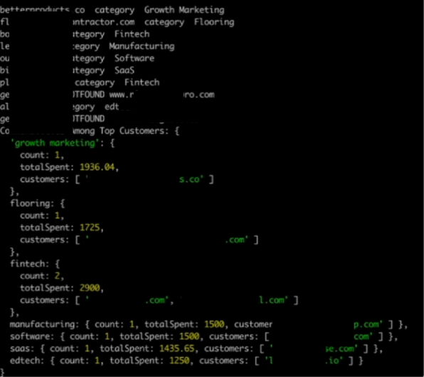

# Use AI to analyze and categorize your top customers on Sripe

# example image 


## Getting started 

### Env variables 
put a `.env`` file in the root directory with the following variables

```bash
OPENAI_API_KEY=sk-...
STRIPE_KEY=rk_live_...
```

### Run the project

```bash
# install dependencies
npm i

# terminal 1 - parcel build
npm run watch 

# terminal 2 - nodemon watch built file
npm run start
```

### Stripe Permissions 
Read only: payment intent, customers, invoices, subscriptions, charges,


### Adjustements 

by default, it does top 10 customers. 

You can change this line to `100` or any other number to analyze more customers. 

```js
const topCustomers = customerSpend.slice(0, 10);
```
